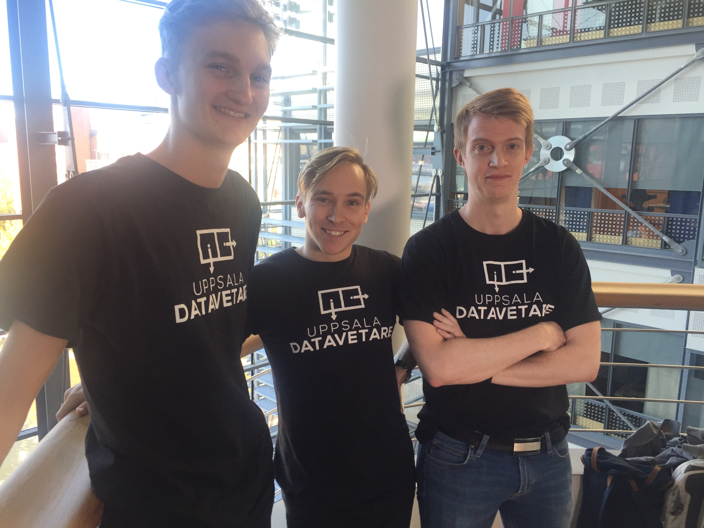

# Openhack 2017 - Shotgun Sorters

License: MIT

## Case from Migrationsverket

We have chosen to work with the case from Migrationsverket using flat-file JSON and basic html, CSS and NodeJS with Xcode.

## Day one
What we have done so far:
* Set up a GitHub.
* Dowloaded pictures and songs for the slides.
* Began coding on the client.
* Added bootstrap to the site.

## Day two
* Started implementing node.js backend together with express.js
* Admin interface is working to an extent.
* Wrote an entire front-end for the mobile part of the challange just to ditch the idea for
native instead.
* Native now communicates with nodejs server to fetch urls for sounds & images
* Started on our presentation.

## Day three (presentation day)
* TODO
